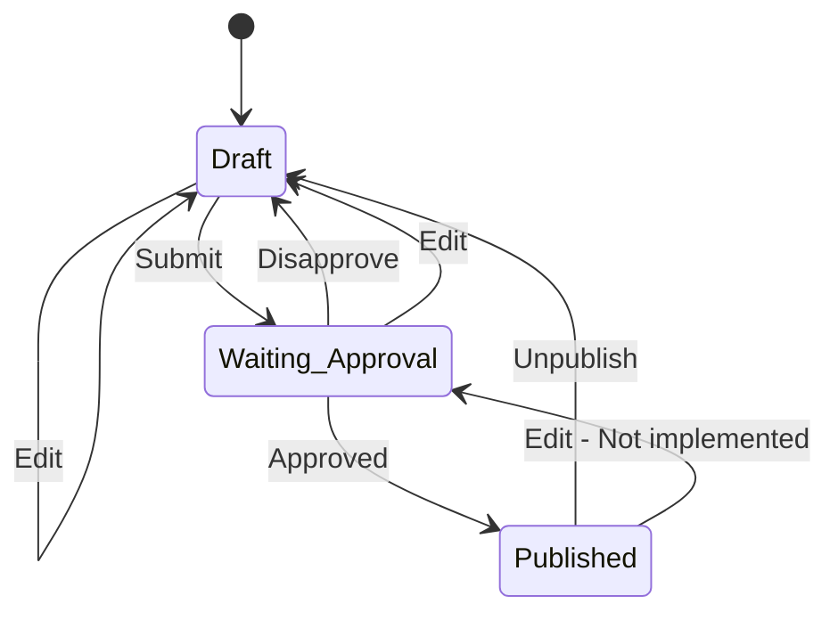

# Blogging website

## Requirements

- [x] User add a new post as draft
- [x] User see a list of thier own posts
- [x] Author edit a post 
- [x] Author submits a post
- [x] Edit on waiting approval put blog back to draft
- [x] Admin see a list of posts that need approval
- [x] Admin approves a post
- [x] Admin disapprove a post
- [x] Author & Admin Unpublish a blog
- [x] Home page shows list of published posts
- [x] Handle permissions using django-fsm
- [x] Generate graph from code
